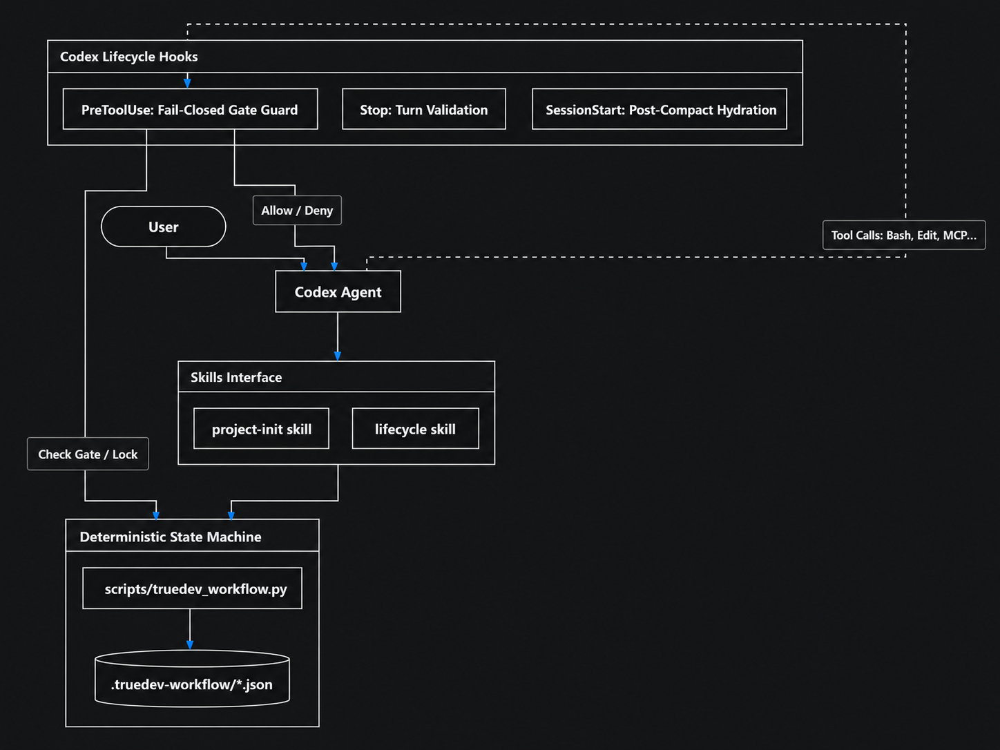

# TrueDev Workflow

**English** | [Русский](README.ru.md)

A Codex plugin that keeps a long task from drifting.

On a task that runs for hours, an agent tends to wander. It edits files nobody asked about, calls
work finished without running anything, and commits or pushes on its own initiative. TrueDev breaks
the work into named steps and stops at the ones that matter, waiting for you to say yes out loud.
Until you do, changes to the repository are blocked — not by the agent promising to behave, but by
Codex hooks that refuse the tool call.


## What you get

| Component | What it does |
| --- | --- |
| `project-init` skill | Turns a specification into requirements, a PRD, architecture decisions, phases, and dependency-ordered slices |
| `lifecycle` skill | Walks one slice from context through scope, plan, implementation, tests, review, docs, and closeout |
| Codex hooks | Refuse file-changing tools while a gate is open, and check the state file when a turn ends |
| Python runner | Owns the state file: validated transitions, atomic writes, an archive of finished work, and a Git safety check |

The skills do not assume a stack. They read your repository to find out how it builds and tests
itself rather than reaching for npm, React, Vitest, Playwright, or a `master` branch.

## Requirements

- Codex with plugin and hook support
- Git
- Python 3.9 or newer — `python3` on macOS and Linux, `python` on Windows

Codex shows you each hook and asks you to trust it by hash. Without trusted hooks the skills and the
runner still work, but nothing blocks changes automatically.

## Install

```text
codex plugin marketplace add itpartypattaya/truedev-codex-workflow --ref main
codex plugin add truedev-workflow@truedev-workflow
```

Start a new Codex task afterwards so the skills and hooks load. Open `/hooks` in the Codex CLI to
review the bundled hooks and trust them.

To work on the plugin itself, point the marketplace at your checkout:

```text
codex plugin marketplace add <absolute-path-to-this-checkout>
codex plugin add truedev-workflow@truedev-workflow
```

## Using it

```text
$project-init Analyze docs/spec.md and prepare implementation-ready project documentation.
$project-init status

$lifecycle Start the next approved slice.
$lifecycle status
$lifecycle Continue the active step.
```

Approvals happen in conversation. At a gate the skill shows you what it did, states what it wants to
do next, and stops. When you approve that specific step, the skill records it through the runner. A
vague "go on" does not count as approval when the decision is unclear — you have to name the thing
you are approving.

## The flow

```text
specification
  → INPUT_VALIDATION → PRD → ARCHITECTURE → PLANNING → DECOMPOSITION → FINALIZE
  → docs/plan/slice-NNN-*.md
  → CONTEXT_CHECK → SCOPE → PLAN → COMPONENTS → IMPLEMENT
  → TEST → VERIFY → REVIEW → DOCUMENT → CLOSE
```

`project-init` produces the plan once. `lifecycle` then runs per slice. Five of its ten steps are
gates that wait for you: SCOPE, COMPONENTS, VERIFY, REVIEW, and CLOSE.

The pieces fit together like this. The agent drives the skills, the skills drive the runner, the
runner owns the state file, and the hooks sit in front of every tool call to check the current gate:



After PLAN the lifecycle asks you to compact the Codex session, because the plan is long and the
implementation should not carry it. Compacting clears that gate and hands the next session a short
summary — the workflow name, the current step, its status, and the slice file. Your task text and
raw state never make it into that summary. If your Codex build does not emit a compact event, you
can release the gate deliberately with `lifecycle skip-compact --user-confirmed`.

## Starting on a project that already exists

Most repositories are not empty, and the skill is not allowed to guess what yours is. So it asks. In
the commands below, `<RUNNER>` is the bundled script the plugin installs, at
`<plugin-root>/scripts/truedev_workflow.py`; the skill runs these for you, and you can run them
yourself to see the same answers.

```text
python3 <RUNNER> detect
```

That prints, as JSON, the stack and package manager it found, the build, lint, test, and E2E commands
that actually exist, which planning documents are already written, and the phase it suggests you
enter at. It only reads files. It writes nothing and decides nothing.

You confirm the commands once, and they go into `truedev.project.json` in the repository root:

```text
python3 <RUNNER> project-config init --build "npm run build" --test "npm test" --user-confirmed
```

From then on the skill runs your commands instead of reaching for npm or Vitest. A command recorded
as `null` means that layer does not exist here, and the skill says the check was skipped rather than
inventing one. The file is committed with the project, and it is never written without your
confirmation.

If the project already has requirements, a PRD, or an architecture document, you can enter the
process partway instead of regenerating them:

```text
python3 <RUNNER> project-init start --project "app" --spec "docs/spec.md" \
  --from PLANNING --user-confirmed
```

The earlier phases are recorded as pre-existing, with your explicit receipt against each one. The
workflow never claims it reviewed a document it did not write.

When it is time to pick the next slice, the runner answers rather than the model:

```text
python3 <RUNNER> project-init next-slice
```

It returns the first pending slice whose dependencies are all completed, or names exactly which
slices are blocked and on what. Without `--plan-dir` it uses the plan directory from
`truedev.project.json`.

## Commands

The skills run these for you. `<RUNNER>` is the bundled script at
`<plugin-root>/scripts/truedev_workflow.py`.

| Command | What it does |
| --- | --- |
| `project-init start --project <name> --spec <source>` | Spec → requirements → PRD → architecture → plan → slices |
| `project-init start ... --from <PHASE> --user-confirmed` | Start partway, adopting what the repository already has |
| `project-init status` | Which phase you are on, and the one next action |
| `project-init complete --phase <PHASE> --user-confirmed` | Your approval on a phase gate. Without it the next phase does not start |
| `project-init next-slice` | Which slice is ready, and why the others are not |
| `lifecycle start --task <task> --slice <file>` | Preflight, then open a lifecycle for one slice |
| `lifecycle status` | The step table, the open gate, and the one next action |
| `lifecycle complete --step <STEP> --user-confirmed` | Your approval on a user gate. The only thing that clears one |
| `lifecycle skip-compact --user-confirmed` | Continue without compacting, on purpose. Recorded, and shown by `status` afterwards |
| `lifecycle recover --accept-current-branch --user-confirmed` | Rebind a workflow whose branch changed underneath it |
| `lifecycle abandon --user-confirmed` | Keep the original state in history and start clean |
| `detect` / `project-config show` | What this repository is, and the commands you confirmed |

`approve` and `complete` are the same command, and so are `release-compact` and `skip-compact`.
Both spellings work; the second of each pair is the one the documentation and `status` use.

## Where state lives

Everything active sits in `.truedev-workflow/` at the repository root, and it must be Git-ignored —
the runner refuses to start otherwise. Transitions are serialized, writes are atomic, invalid
transitions are rejected, and finished work is archived under `.truedev-workflow/history/`.

An open gate also covers linked worktrees and nested checkouts such as submodules, so moving to a
sibling directory does not get you past it.

If the state file is damaged, matching tool calls fail closed until you fix it. `abandon
--user-confirmed` saves the original bytes before clearing the workflow. If the branch changed under
a valid workflow, `recover --accept-current-branch --user-confirmed` rebinds it. With no active
state, the plugin does nothing at all.

## What the gates actually enforce

Hooks are guardrails, not a security boundary — please do not treat them as one. The pre-tool hook
sees Codex shell commands, `apply_patch`, subagents, and MCP calls that match the plugin's pattern.
Hosted tools and specialized tool paths may not emit hook events at all. Your repository
permissions, sandboxing, protected branches, CI, and provider-side authorization are what actually
hold the line.

While a gate is open the agent can still gather evidence, but only through the bundled `inspect
git-status`, `inspect git-diff`, and `inspect file` commands. Raw shell reads are blocked, because
Git helpers and PowerShell providers can turn a supposedly read-only command into code execution or
a read outside the repository. The diff inspector leaves out likely credential files and tells you
which ones it left out, so a short diff is never mistaken for a complete one.

A few details worth knowing; [`SECURITY.md`](SECURITY.md) has the full trust model:

- One launcher serves both platforms. It reads `PLUGIN_ROOT` inside Python and insists on an
  absolute installed path, so a broken installation does nothing instead of running a same-named
  script out of the repository you are reviewing.
- The state directory has to be a real directory inside the repository. A symlink or a Windows
  junction anywhere in that path is refused for reads and writes alike.
- Stored text carries no line breaks and status prints one field per line, so text from the
  repository cannot fake the status the model reads.
- The starting commit is recorded. The guard still compares branch identity, but `status` flags the
  commit as `MOVED` when history is rewritten under an unchanged branch name.
- Output is UTF-8 whatever the console code page says.

There is no telemetry and no bundled network client; [`PRIVACY.md`](PRIVACY.md) states exactly what
is stored and where.

## Git safety

The workflow never pulls, stages everything, commits, pushes, opens or merges a PR, deletes a
branch, or removes a worktree on its own. Before it touches the repository it:

1. finds the real default and current branches instead of guessing;
2. looks for uncommitted work, likely credential files, and a Git operation already in progress;
3. leaves changes it does not own alone;
4. asks for explicit permission for anything external or destructive;
5. stages only the files belonging to the current task when you authorize a commit.

## Development

Run the test suite:

```text
python -m unittest discover -s tests -v
```

Validate the plugin and both skills:

```text
python <plugin-creator>/scripts/validate_plugin.py .
python <skill-creator>/scripts/quick_validate.py skills/lifecycle
python <skill-creator>/scripts/quick_validate.py skills/project-init
```

Check the release contract and build the public package:

```text
python scripts/validate_release.py
python scripts/package_plugin.py
```

The ZIP deliberately leaves out marketplace metadata, tests, eval definitions and fixtures,
screenshots, and repository-only docs. A skills-only submission must not declare
`interface.screenshots`; the review images in `docs/images/` are separate submission assets.

## Publishing

The publisher checklist, five positive and three negative review cases, the listing copy, and the
steps only the account owner can perform are in
[`docs/public-submission.md`](docs/public-submission.md). The benchmark and a standalone evidence
viewer are in [`evals/results/benchmark.md`](evals/results/benchmark.md) and
[`evals/results/review.html`](evals/results/review.html) — one run per case, a behavioral comparison
rather than a statistical claim, produced from the exact commit they describe. Support goes through [`SUPPORT.md`](SUPPORT.md) and GitHub Issues.

## License

MIT. The original upstream copyright and license are kept in [`LICENSE`](LICENSE).
