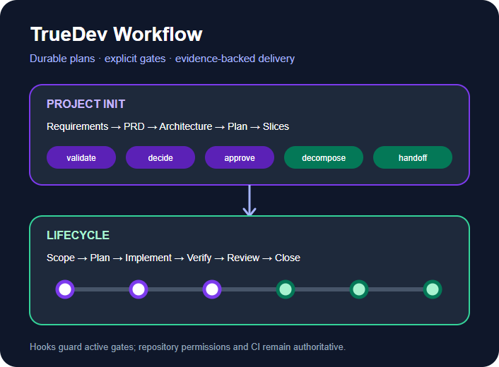
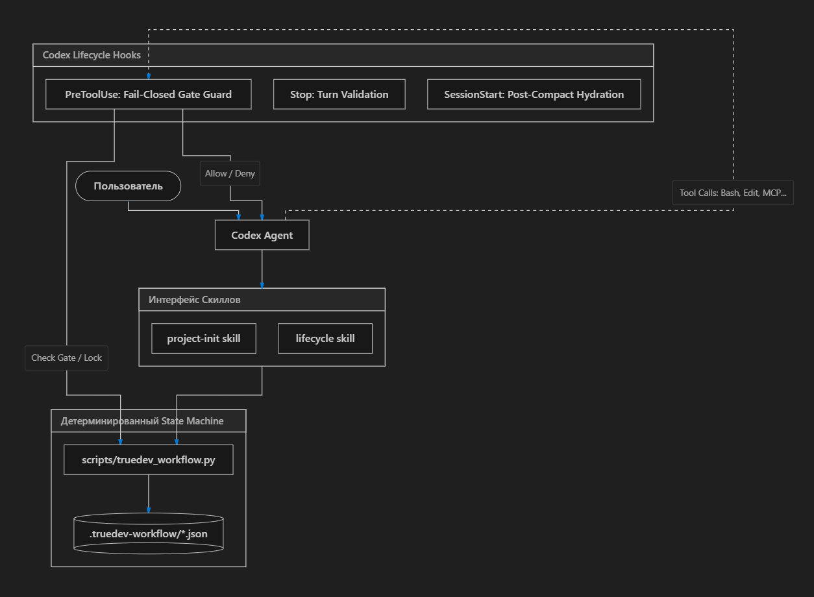

# TrueDev Workflow

[English](README.md) | **Русский**

Плагин для Codex, который не даёт длинной задаче расползтись.

Когда задача идёт часами, агент начинает уходить в сторону: правит файлы, о которых его не просили,
объявляет работу готовой, ничего не запустив, коммитит и пушит по своей инициативе. TrueDev
разбивает работу на именованные шаги и на важных шагах останавливается — ждёт, пока вы вслух
скажете «да». Пока не сказали, изменения в репозитории заблокированы: не обещанием агента вести себя
прилично, а хуками Codex, которые просто не пропускают вызов инструмента.



## Что внутри

| Компонент | Что делает |
| --- | --- |
| Скилл `project-init` | Превращает спецификацию в требования, PRD, архитектурные решения, этапы и слайсы, упорядоченные по зависимостям |
| Скилл `lifecycle` | Проводит один слайс от изучения контекста через согласование объёма, план, реализацию, тесты, ревью, документацию до закрытия |
| Хуки Codex | Не пропускают инструменты, меняющие файлы, пока открыт гейт, и проверяют состояние в конце хода |
| Python-раннер | Владеет файлом состояния: проверенные переходы, атомарная запись, архив завершённой работы и проверка безопасности Git |

Скиллы не привязаны к стеку. Вместо того чтобы тянуться к npm, React, Vitest, Playwright или ветке
`master`, они читают ваш репозиторий и выясняют, чем он на самом деле собирается и тестируется.

## Что нужно

- Codex с поддержкой плагинов и хуков
- Git
- Python 3.9 или новее — `python3` на macOS и Linux, `python` на Windows

Codex показывает каждый хук и просит подтвердить доверие по хешу. Без доверенных хуков скиллы и
раннер работают, но автоматически изменения никто не блокирует.

## Установка

```text
codex plugin marketplace add itpartypattaya/truedev-codex-workflow --ref main
codex plugin add truedev-workflow@truedev-workflow
```

После установки начните новую задачу Codex, чтобы скиллы и хуки загрузились. Откройте `/hooks` в
Codex CLI, посмотрите, что за хуки приехали, и подтвердите доверие.

Чтобы дорабатывать сам плагин, укажите marketplace на свой checkout:

```text
codex plugin marketplace add <absolute-path-to-this-checkout>
codex plugin add truedev-workflow@truedev-workflow
```

## Как этим пользоваться

```text
$project-init Проанализируй docs/spec.md и подготовь проектную документацию для реализации.
$project-init status

$lifecycle Начни следующий согласованный слайс.
$lifecycle status
$lifecycle Продолжи текущий шаг.
```

Согласование идёт в диалоге. На гейте скилл показывает, что сделал, говорит, что собирается делать
дальше, и останавливается. Когда вы одобряете именно этот шаг, скилл записывает согласование через
раннер. Расплывчатое «продолжай» согласованием не считается, если непонятно, что именно вы одобрили —
шаг нужно назвать.

## Как устроен процесс

```text
спецификация
  → INPUT_VALIDATION → PRD → ARCHITECTURE → PLANNING → DECOMPOSITION → FINALIZE
  → docs/plan/slice-NNN-*.md
  → CONTEXT_CHECK → SCOPE → PLAN → COMPONENTS → IMPLEMENT
  → TEST → VERIFY → REVIEW → DOCUMENT → CLOSE
```

`project-init` строит план один раз. Дальше `lifecycle` прогоняется по одному разу на каждый слайс.
Пять из десяти его шагов — гейты, которые ждут вас: SCOPE, COMPONENTS, VERIFY, REVIEW и CLOSE.

Собирается это так. Агент управляет скиллами, скиллы — раннером, раннер владеет файлом состояния, а
хуки стоят перед каждым вызовом инструмента и сверяются с текущим гейтом:



После PLAN скилл просит сжать сессию Codex: план длинный, и тащить его в реализацию незачем. Сжатие
снимает этот гейт и передаёт следующей сессии короткую сводку — название процесса, текущий шаг, его
статус и файл слайса. Текст вашей задачи и содержимое состояния в эту сводку не попадают. Если ваша
сборка Codex не присылает событие о сжатии, гейт можно снять осознанно:
`lifecycle skip-compact --user-confirmed`.

## Как начать на уже существующем проекте

Репозиторий редко бывает пустым, а угадывать, что у вас за проект, скиллу запрещено. Поэтому он
спрашивает. В командах ниже `<RUNNER>` — это скрипт, который приезжает вместе с плагином, по пути
`<plugin-root>/scripts/truedev_workflow.py`; скилл запускает их сам, но вы можете запустить их
руками и увидеть ровно те же ответы.

```text
python <RUNNER> detect
```

В ответ приходит JSON: какой стек и пакетный менеджер найдены, какие команды сборки, линтера, тестов
и E2E реально существуют, какие проектные документы уже написаны и с какого этапа имеет смысл
входить. Команда только читает файлы. Она ничего не пишет и ничего не решает.

Вы один раз подтверждаете команды, и они попадают в `truedev.project.json` в корне репозитория:

```text
python <RUNNER> project-config init --build "npm run build" --test "npm test" --user-confirmed
```

После этого скилл запускает ваши команды, а не тянется к npm и Vitest. Команда, записанная как
`null`, означает, что такого слоя в проекте нет: скилл честно скажет, что проверка не выполнялась, а
не выдумает её. Файл коммитится вместе с проектом и никогда не пишется без вашего подтверждения.

Если в проекте уже есть требования, PRD или описание архитектуры, можно войти в процесс с середины,
а не переписывать их заново:

```text
python <RUNNER> project-init start --project "app" --spec "docs/spec.md" \
  --from PLANNING --user-confirmed
```

Ранние этапы помечаются как существовавшие ранее, и на каждом стоит ваша явная расписка. Workflow
не приписывает себе проверку документов, которые не он писал.

А когда приходит время брать следующий слайс, отвечает раннер, а не модель:

```text
python <RUNNER> project-init next-slice
```

Он вернёт первый слайс со статусом pending, у которого выполнены все зависимости, либо назовёт,
какие слайсы заблокированы и чем именно. Без `--plan-dir` он берёт каталог плана из
`truedev.project.json`.

## Команды

Скиллы запускают их за вас. `<RUNNER>` — скрипт из состава плагина, по пути
`<plugin-root>/scripts/truedev_workflow.py`.

| Команда | Что делает |
| --- | --- |
| `project-init start --project <имя> --spec <источник>` | Спецификация → требования → PRD → архитектура → план → слайсы |
| `project-init start ... --from <ФАЗА> --user-confirmed` | Начать с середины, приняв то, что в репозитории уже есть |
| `project-init status` | На какой вы фазе и какое одно действие следующее |
| `project-init complete --phase <ФАЗА> --user-confirmed` | Ваше одобрение фазы. Без него следующая не начнётся |
| `project-init next-slice` | Какой слайс готов и почему остальные — нет |
| `lifecycle start --task <задача> --slice <файл>` | Преflight, затем открыть жизненный цикл одного слайса |
| `lifecycle status` | Таблица шагов, открытый гейт и одно следующее действие |
| `lifecycle complete --step <ШАГ> --user-confirmed` | Ваше одобрение гейта. Единственное, что его снимает |
| `lifecycle skip-compact --user-confirmed` | Осознанно продолжить без сжатия. Записывается, и потом видно в `status` |
| `lifecycle recover --accept-current-branch --user-confirmed` | Перепривязать процесс, под которым сменилась ветка |
| `lifecycle recover --rebuild --task <задача> --user-confirmed` | Пересоздать потерянное состояние. Шаги начинаются заново, все гейты возвращаются непройденными |
| `lifecycle abandon --user-confirmed` | Сохранить исходное состояние в истории и начать заново |
| `detect` / `project-config show` | Что за репозиторий и какие команды вы подтвердили |

`approve` и `complete` — одна и та же команда, `release-compact` и `skip-compact` — тоже. Работают
оба написания; в документации и в `status` используется второе из пары.

## Где живёт состояние

Всё активное лежит в `.truedev-workflow/` в корне репозитория, и этот каталог обязан быть в
`.gitignore` — иначе раннер откажется стартовать. Переходы выполняются по очереди, запись атомарная,
недопустимые переходы отклоняются, завершённая работа уезжает в `.truedev-workflow/history/`.

Открытый гейт распространяется и на связанные worktree, и на вложенные репозитории вроде
сабмодулей — перейти в соседний каталог и обойти его не получится.

Если файл состояния повреждён, подходящие вызовы инструментов блокируются, пока вы не почините.
`abandon --user-confirmed` сохраняет исходные байты и очищает процесс. Если под живым процессом
сменилась ветка, привязать его к текущей можно через
`recover --accept-current-branch --user-confirmed`. Когда активного состояния нет, плагин не делает
вообще ничего.

Бывает и так, что репозиторий пережил собственное состояние: случайное удаление, свежий клон,
другая машина. `recover --rebuild --task <задача> --user-confirmed` пересоздаёт его и возвращает
гейты в начало, а не гадает, как далеко зашла работа. Коммиты и тронутые тесты показывают, что
работа была; они никогда не показывают, что вы её одобрили. Всё, что восстанавливало бы одобрения
по артефактам, молча списало бы оставшиеся гейты. Байты прежнего состояния, если они уцелели,
сохраняются в `.truedev-workflow/history/`.

## Что гейты действительно защищают

Хуки — это подстраховка, а не граница безопасности, и относиться к ним как к границе не стоит.
Pre-tool-хук видит команды оболочки Codex, `apply_patch`, субагентов и вызовы MCP, попавшие под
шаблон плагина. Хостинговые и специализированные инструменты могут вообще не присылать события.
По-настоящему держат оборону права в репозитории, песочница, защищённые ветки, CI и авторизация на
стороне провайдера.

Пока гейт открыт, агент всё ещё может собирать доказательства, но только встроенными командами
`inspect git-status`, `inspect git-diff` и `inspect file`. Произвольное чтение через оболочку
запрещено: Git-хелперы и PowerShell-провайдеры умеют превращать якобы безобидную read-only команду в
выполнение кода или чтение за пределами репозитория. Diff-инспектор пропускает файлы, похожие на
хранилища секретов, и обязательно называет, что именно скрыл, — чтобы укороченный diff не приняли за
полный.

Несколько деталей, которые стоит знать; полная модель доверия — в [`SECURITY.md`](SECURITY.md):

- Обе платформы используют один launcher. Он читает `PLUGIN_ROOT` внутри Python и требует
  абсолютный путь установки, поэтому сломанная установка просто ничего не делает, а не запускает
  одноимённый скрипт из репозитория, который вы проверяете.
- Каталог состояния должен быть настоящим каталогом внутри репозитория. Симлинк или junction в этом
  пути отклоняется и на чтение, и на запись.
- В сохранённом тексте не бывает переводов строки, а `status` печатает по одному полю в строке —
  чтобы текст из репозитория не мог подделать статус, который читает модель.
- Коммит на старте записывается. Страж по-прежнему сверяет имя ветки, но `status` пометит коммит как
  `MOVED`, если историю переписали под тем же именем.
- Вывод всегда в UTF-8, независимо от кодовой страницы консоли.

Телеметрии и встроенного сетевого клиента нет; что именно и где хранится, написано в
[`PRIVACY.md`](PRIVACY.md).

## Безопасность Git

Workflow никогда сам не делает pull, не добавляет в индекс всё подряд, не коммитит, не пушит, не
создаёт и не сливает PR, не удаляет ветки и worktree. Прежде чем тронуть репозиторий, он:

1. выясняет настоящую основную и текущую ветки, а не угадывает их;
2. ищет незакоммиченную работу, похожие на секреты файлы и незавершённую операцию Git;
3. не трогает изменения, которые ему не принадлежат;
4. просит явного разрешения на всё внешнее или разрушительное;
5. при разрешённом коммите добавляет в индекс только файлы текущей задачи.

## Разработка

Прогнать тесты:

```text
python -m unittest discover -s tests -v
```

Проверить плагин и оба скилла:

```text
python <plugin-creator>/scripts/validate_plugin.py .
python <skill-creator>/scripts/quick_validate.py skills/lifecycle
python <skill-creator>/scripts/quick_validate.py skills/project-init
```

Проверить релизный контракт и собрать публичный пакет:

```text
python scripts/validate_release.py
python scripts/package_plugin.py
```

В ZIP намеренно не попадают метаданные marketplace, тесты, определения и фикстуры eval, скриншоты и
внутренняя документация. Публикация «только скиллы» не должна объявлять `interface.screenshots`;
картинки для ревью в `docs/images/` — отдельные материалы для подачи.

## Публикация

Чек-лист издателя, пять положительных и три отрицательных сценария ревью, текст листинга и шаги,
которые может выполнить только владелец аккаунта, собраны в
[`docs/public-submission.md`](docs/public-submission.md). Бенчмарк и автономный просмотрщик
доказательств — в [`evals/results/benchmark.md`](evals/results/benchmark.md) и
[`evals/results/review.html`](evals/results/review.html): по одному прогону на сценарий, это
сравнение поведения, а не статистическое доказательство, снятое с того самого коммита, который
оно описывает. Поддержка — через
[`SUPPORT.md`](SUPPORT.md) и GitHub Issues.

## Лицензия

MIT. Исходные авторские права и лицензия сохранены в [`LICENSE`](LICENSE).
